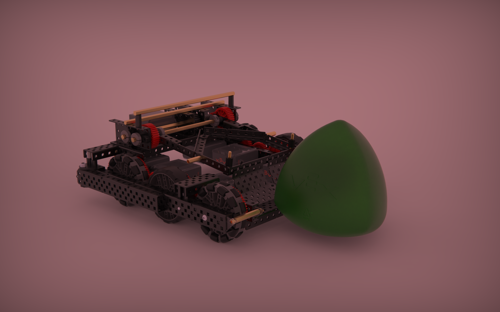

# Team 1599V - Vietnamese Banana Farmers

We are a team from Saigon South International School.

# Competitions:
Nov 11 Scrimage at SSIS

We did not do well because the low bot design restricts a good catapult and also we had to do a two motor catapult so did not have a effective pnumatic intake either. Cool RGB thou.

Dec 1-2 Formosa at TAS (Taipei)

We did okay, 18th out of 32.

Dec 14 Scrimage at Fullbright

Made to SF

Jan 20 North Nationals (Hanoi)

Judges Award

Feb 7 South Nationals at SSIS

Design Award & Tournement Champion

